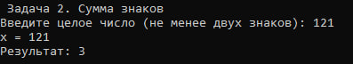

[README.md](https://github.com/user-attachments/files/32932724/README.md)
# Михлин Дмитрий Ла3 Лабораторная №1

# Задание 1

## Задача 2

### Текст задачи

**Сумма знаков.** Дана сигнатура метода: `public int sumLastNums(int x);`
Необходимо реализовать метод таким образом, чтобы он возвращал результат сложения двух последних знаков числа x, предполагая, что знаков в числе не менее двух.

Пример: x=4568 → результат: 14

### Алгоритм решения

1. Берём последнюю цифру числа: `last = |x| % 10`.
2. Берём предпоследнюю цифру: `prev = (|x| / 10) % 10`.
3. Возвращаем их сумму `last + prev`.
4. Используем модуль числа `Math.Abs`, чтобы корректно обрабатывать отрицательные значения.

### Тестирование

**Правильный ввод (x = 4568):**



**Неправильный ввод (введена строка "abc"):**


## Задача 4

### Текст задачи

**Есть ли позитив.** Дана сигнатура метода: `public bool isPositive(int x);`
Необходимо реализовать метод так, чтобы он возвращал true, если число x положительное.

Пример 1: x=3 → true
Пример 2: x=-5 → false

### Алгоритм решения

1. Сравниваем x с нулём.
2. Если x > 0 — возвращаем `true`, иначе `false`.

### Тестирование

**Правильный ввод (x = 3):**


**Неправильный ввод (введена строка "abc"):**


## Задача 6

### Текст задачи

**Большая буква.** Дана сигнатура метода: `public bool isUpperCase(char x);`
Необходимо реализовать метод так, чтобы он возвращал true, если символ x — большая буква в диапазоне от 'A' до 'Z'.

Пример 1: x='D' → true
Пример 2: x='q' → false

### Алгоритм решения

1. Проверяем, что код символа попадает в диапазон от 'A' до 'Z'.
2. Возвращаем результат проверки.

### Тестирование

**Правильный ввод (x = 'D'):**


**Неправильный ввод (введено "DD" — больше одного символа):**


## Задача 8

### Текст задачи

**Равенство.** Дана сигнатура метода: `public bool isEqual(int a, int b, int c);`
Необходимо реализовать метод так, чтобы он возвращал true, если все три полученных числа равны.

Пример 1: a=3 b=3 c=3 → true
Пример 2: a=2 b=15 c=2 → false

### Алгоритм решения

1. Проверяем `a == b` и `b == c`.
2. Возвращаем `true` только если оба условия выполнены.

### Тестирование

**Правильный ввод (a=3, b=3, c=3):**


**Неправильный ввод (введена строка "abc"):**


## Задача 10

### Текст задачи

**Многократный вызов.** Дана сигнатура метода: `public int lastNumSum(int a, int b)`
Необходимо реализовать метод так, чтобы он считал сумму цифр двух чисел из разряда единиц. Выполнить с его помощью последовательное сложение пяти чисел.

Пример: 5+11=6; 6+123=9; 9+14=13; 13+1=4 → Итого 4

### Алгоритм решения

1. Метод `lastNumSum(a, b)` возвращает `(|a| % 10) + (|b| % 10)`.
2. Последовательно применяем метод к текущему результату и следующему числу.
3. Выводим промежуточные суммы и итог.

### Тестирование

**Правильный ввод (числа 5, 11, 123, 14, 1, 7):**


**Неправильный ввод (введена строка "abc"):**


# Задание 2

## Задача 2

### Текст задачи

**Безопасное деление.** Дана сигнатура метода: `public double safeDiv(int x, int y);`
Необходимо реализовать метод так, чтобы он возвращал деление x на y и при этом не выбрасывал ошибку деления на 0. При делении на 0 вернуть 0.

Пример 1: x=5 y=0 → 0
Пример 2: x=8 y=2 → 4

### Алгоритм решения

1. Если `y == 0` — возвращаем `0`.
2. Иначе возвращаем `(double)x / y`.

### Тестирование

**Правильный ввод (x=8, y=2):**


**Неправильный ввод (деление на ноль x=5, y=0 — метод корректно возвращает 0):**


## Задача 4

### Текст задачи

**Строка сравнения.** Дана сигнатура метода: `public String makeDecision(int x, int y);`
Необходимо реализовать метод так, чтобы он возвращал строку, которая включает два принятых методом числа и корректно выставленный знак операции сравнения.

Пример 1: x=5 y=7 → "5 < 7"
Пример 2: x=8 y=-1 → "8 > -1"
Пример 3: x=4 y=4 → "4 == 4"

### Алгоритм решения

1. Если `x < y` — возвращаем строку с `<`.
2. Если `x > y` — возвращаем строку с `>`.
3. Иначе — строку с `==`.

### Тестирование

**Правильный ввод (x=5, y=7):**


**Неправильный ввод (введена строка "abc"):**


## Задача 6

### Текст задачи

**Тройная сумма.** Дана сигнатура метода: `public bool sum3(int x, int y, int z);`
Необходимо реализовать метод так, чтобы он возвращал true, если два любых числа из трёх можно сложить так, чтобы получить третье.

Пример 1: x=5 y=7 z=2 → true
Пример 2: x=8 y=-1 z=4 → false

### Алгоритм решения

1. Проверяем три условия: `x + y == z`, `x + z == y`, `y + z == x`.
2. Если хотя бы одно истинно — возвращаем `true`.

### Тестирование

**Правильный ввод (x=5, y=7, z=2):**


**Неправильный ввод (введена строка "abc"):**


## Задача 8

### Текст задачи

**Возраст.** Дана сигнатура метода: `public String age(int x);`
Необходимо реализовать метод так, чтобы он возвращал строку: число x и одно из слов «год», «года», «лет».

Слово «год» — если x заканчивается на 1, кроме 11.
Слово «года» — если x заканчивается на 2, 3 или 4, кроме 12, 13, 14.
Слово «лет» — во всех остальных случаях.

Пример 1: x=5 → "5 лет"
Пример 2: x=31 → "31 год"
Пример 3: x=44 → "44 года"

### Алгоритм решения

1. Вычисляем `lastTwo = x % 100` и `last = x % 10`.
2. Если `lastTwo` в диапазоне 11..14 — возвращаем «лет».
3. Иначе: `last == 1` → «год»; `last` в 2..4 → «года»; иначе — «лет».

### Тестирование

**Правильный ввод (x=31):**


**Неправильный ввод (x=200 — вне диапазона [0; 150]):**


## Задача 10

### Текст задачи

**Вывод дней недели.** Дана сигнатура метода: `public void printDays(String x);`
Необходимо вывести на экран название переданного дня и всех последующих до конца недели. Если строка не является днём — вывести «это не день недели».

Пример 1: "четверг" → четверг, пятница, суббота, воскресенье
Пример 2: "чг" → это не день недели

### Алгоритм решения

1. Определяем номер дня недели через последовательность `if / else if`.
2. Если не распознан — выводим «это не день недели» и выходим.
3. В цикле от найденного номера до 7 выводим названия дней.

### Тестирование

**Правильный ввод (x = "четверг"):**


**Неправильный ввод (x = "чг"):**


# Задание 3

## Задача 2

### Текст задачи

**Числа наоборот.** Дана сигнатура метода: `public String reverseListNums(int x);`
Необходимо реализовать метод так, чтобы он возвращал строку, в которой записаны все числа от x до 0 включительно.

Пример: x=5 → "5 4 3 2 1 0"

### Алгоритм решения

1. Цикл `for` от x до 0.
2. Склеиваем числа в строку через пробел.

### Тестирование

**Правильный ввод (x = 5):**


**Неправильный ввод (x = -3 — вне диапазона [0; 1000]):**


## Задача 4

### Текст задачи

**Возведение в степень.** Дана сигнатура метода: `public int pow(int x, int y);`
Необходимо реализовать метод так, чтобы он возвращал результат возведения x в степень y.

Пример: x=2 y=5 → 32

### Алгоритм решения

1. `result = 1`.
2. В цикле y раз умножаем `result` на x.

### Тестирование

**Правильный ввод (x=2, y=5):**


**Неправильный ввод (y = -1 — вне диапазона [0; 10]):**


## Задача 6

### Текст задачи

**Одинаковость.** Дана сигнатура метода: `public bool equalNum(int x);`
Необходимо реализовать метод так, чтобы он возвращал true, если все знаки числа одинаковы.

Пример 1: x=1111 → true
Пример 2: x=1211 → false

### Алгоритм решения

1. Запоминаем последнюю цифру числа.
2. В цикле `while` отбрасываем последнюю цифру и сравниваем каждую следующую с запомненной.
3. Если встретили отличие — возвращаем `false`, иначе `true`.

### Тестирование

**Правильный ввод (x = 1111):**


**Неправильный ввод (введена строка "abc"):**


## Задача 8

### Текст задачи

**Левый треугольник.** Дана сигнатура метода: `public void leftTriangle(int x);`
Необходимо вывести треугольник из символов '*', у которого x символов в высоту, а количество символов в ряду совпадает с номером строки.

Пример: x=4 →
```
*
**
***
****
```

### Алгоритм решения

1. Внешний цикл от 1 до x — строки.
2. Внутренний цикл — выводим i символов '*' в текущей строке.

### Тестирование

**Правильный ввод (x = 4):**


**Неправильный ввод (x = 0 — вне диапазона [1; 50]):**


## Задача 10

### Текст задачи

**Угадайка.** Дана сигнатура метода: `public void guessGame()`
Необходимо реализовать метод так, чтобы он генерировал случайное число от 0 до 9, считывал ввод пользователя и сообщал, угадал ли он. Метод работает до тех пор, пока число не будет угадано. После — вывести количество попыток.

### Алгоритм решения

1. `Random.Next(0, 10)` — загаданное число.
2. Цикл `while(true)`: считываем число, проверяем диапазон [0; 9].
3. Если угадал — выводим количество попыток и выходим из цикла.
4. Иначе — сообщение и продолжаем.

### Тестирование

**Правильный ввод (угадывание за несколько попыток):**


**Неправильный ввод (введено число 15 — вне диапазона [0; 9]):**


# Задание 4

## Задача 2

### Текст задачи

**Поиск последнего значения.** Дана сигнатура метода: `public int findLast(int[] arr, int x);`
Необходимо реализовать метод так, чтобы он возвращал индекс последнего вхождения числа x в массив arr. Если число не входит в массив — возвращается -1.

Пример: arr=[1,2,3,4,2,2,5] x=2 → результат: 5

### Алгоритм решения

1. Идём по массиву с конца.
2. При первом совпадении возвращаем индекс.
3. Если не нашли — возвращаем -1.

### Тестирование

**Правильный ввод (arr = "1 2 3 4 2 2 5", x = 2):**


**Неправильный ввод (введена строка "abc def"):**


## Задача 4

### Текст задачи

**Добавление в массив.** Дана сигнатура метода: `public int[] add(int[] arr, int x, int pos);`
Необходимо реализовать метод так, чтобы он возвращал новый массив со вставленным значением x в позицию pos.

Пример: arr=[1,2,3,4,5] x=9 pos=3 → [1,2,3,9,4,5]

### Алгоритм решения

1. Создаём массив длиной на 1 больше.
2. Копируем элементы до позиции pos.
3. Кладём x в позицию pos.
4. Копируем оставшиеся элементы со сдвигом на 1.

### Тестирование

**Правильный ввод (arr="1 2 3 4 5", x=9, pos=3):**


**Неправильный ввод (pos = 10 — вне диапазона [0; 5]):**


## Задача 6

### Текст задачи

**Реверс.** Дана сигнатура метода: `public void reverse(int[] arr);`
Необходимо реализовать метод так, чтобы он изменял массив arr — после работы массив должен быть записан задом-наперёд.

Пример: arr=[1,2,3,4,5] → [5,4,3,2,1]

### Алгоритм решения

1. Идём с двух концов к середине.
2. Меняем местами i-й и (len-1-i)-й элементы.

### Тестирование

**Правильный ввод (arr = "1 2 3 4 5"):**


**Неправильный ввод (пустая строка):**


## Задача 8

### Текст задачи

**Объединение.** Дана сигнатура метода: `public int[] concat(int[] arr1, int[] arr2);`
Необходимо реализовать метод так, чтобы он возвращал новый массив: сначала элементы первого массива, затем второго.

Пример: arr1=[1,2,3] arr2=[7,8,9] → [1,2,3,7,8,9]

### Алгоритм решения

1. Создаём массив длиной `arr1.Length + arr2.Length`.
2. Копируем элементы первого массива.
3. Копируем элементы второго массива начиная с позиции `arr1.Length`.

### Тестирование

**Правильный ввод (arr1="1 2 3", arr2="7 8 9"):**


**Неправильный ввод (введена строка "abc"):**


## Задача 10

### Текст задачи

**Удалить негатив.** Дана сигнатура метода: `public int[] deleteNegative(int[] arr);`
Необходимо реализовать метод так, чтобы он возвращал новый массив без отрицательных элементов.

Пример: arr=[1,2,-3,4,-2,2,-5] → [1,2,4,2]

### Алгоритм решения

1. Считаем количество неотрицательных элементов.
2. Создаём новый массив этой длины.
3. Копируем в него все неотрицательные элементы.

### Тестирование

**Правильный ввод (arr = "1 2 -3 4 -2 2 -5"):**


**Неправильный ввод (пустая строка):**


